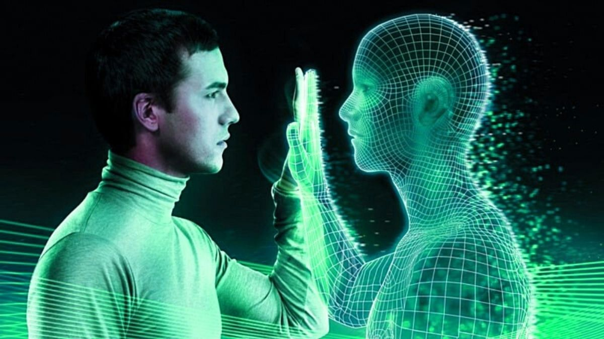

# Running Simulations in Python

---

> *Claude Fried - Data Scientist; Cohort Lead, Data Science*
>
> *08SEP2021*

---

> <a href='https://www.unrevealedfiles.com/is-the-universe-a-computer-simulation/'>*Img Source*</a>

---

A <a href='https://flatironschool.com/campus-and-online-data-science-bootcamp/'>*Flatiron School*</a> Data Science Event

We will talk about ***Running Simulations*** using Python for Data Science.

---

## Table of Contents

### Why run Simulations?

#### What does it mean to run a Simulation?

### Building a Simulation

#### Simulate interactions using a board game: *Risk*

*We will be using Python and Python packages for this workshop (Numpy, Pandas, Matplotlib). We will also be writing functions to streamline our processes.*
